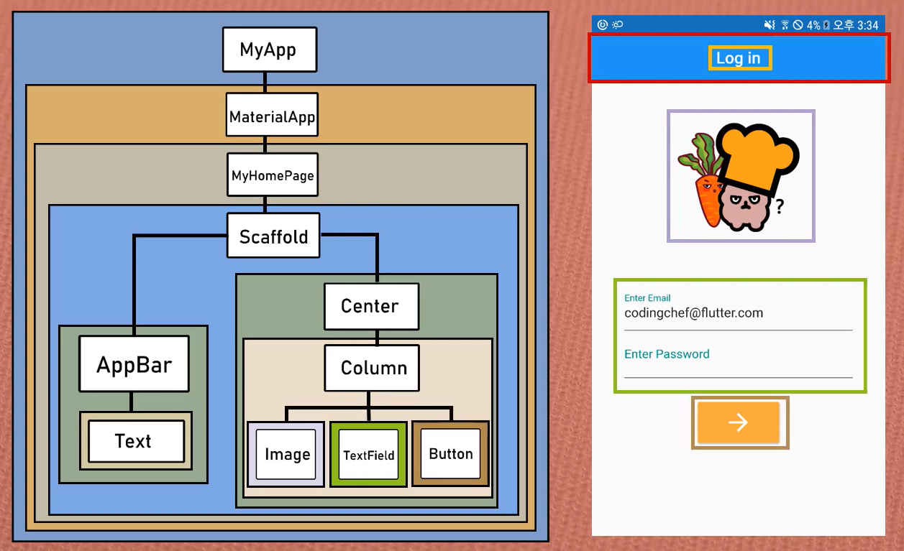

# Chapter 2

## 플러터에서 중요한 위젯!!!

---

### **1. Flutter에서 위젯이란?**
 

- **widget?**
  
  - 독립적으로 실행되는 작은 프로그램
  - 주로 바탕화면 등에 설치해서 날씨나 뉴스, 생활정보 등을 보여줌.
  - 일반적인 그래픽이나 데이터를 처리하는 기능을 가지고 있다

 

- **What is Widget in Flutter?**

  - App의 UI(User Interface)를 만들고 구성하는 모든 기본 단위 요소를 의미한다.
     => Ex) text, icon, image, Text field, button
  - 눈에 보이지 않는 요소(레이아웃을 정의하는 요소)까지 widget이다.
     => Ex) center, padding, column
  - 화면을 구성하는 요소들도 위젯이고, App 그 자체도 하나의 위젯이다.
     Everything is a Widget!!!

---

### **2. Types of Widgets**
 

  - **Stateless Widget**

    - 어떤 움직임이나 변화가 전혀 없는 정적인 위젯
    - 스크린상에 존재만 할 뿐 아무것도 하지 않음 (Ex -> text, image)
    - 어떠한 실시간 데이터도 저장하지 않음
    - 어떠한 변화(모양, 상태)를 유발시키는 value 값을 가지지 않는다. 

 

  - **Stateful Widget**

    - 어떤 상태를 가지고 계속 움직이면서 변화는 동적인 위젯
    - 사용자의 interaction에 따라서 모양이나 상태가 바뀜.
       => Ex) Checkbox, Radio.
    - 데이터를 받게 되었을 때마다 모양이나 상태가 바뀜.
       => Ex) Text Filed에 입력.

 

  - **Inherited Widget**

    - 나중에...!!!

---

### **Flutter Widget Tree**
 

  - Widget들은 tree 구조로 정리될 수 있음.
  - 한 Widget 내에 얼마든지 다른 Widget들을 포함할 수 있다.
  - Widget은 Parent Widget과 Child Widget으로 구성.
  - Parent Widget을 다른 Widget을 내포한다는 의미로, Widget Container 라고도 부른다. 

material app 을 통해 flutter sdk 안에 위젯이란 것을 사용할 수 있다.

scaffold widget, 앱 화면을 구성하기 위한 빈 화면을 만든다. 이 위젯 하위에 앱을 구성하는 위젯을 사용할 수 있다.

---
 

출처 : https://www.youtube.com/watch?v=jI4kqLdqXic&list=PLQt_pzi-LLfpcRFhWMywTePfZ2aPapvyl&index=6&ab_channel=%EC%BD%94%EB%94%A9%EC%85%B0%ED%94%84